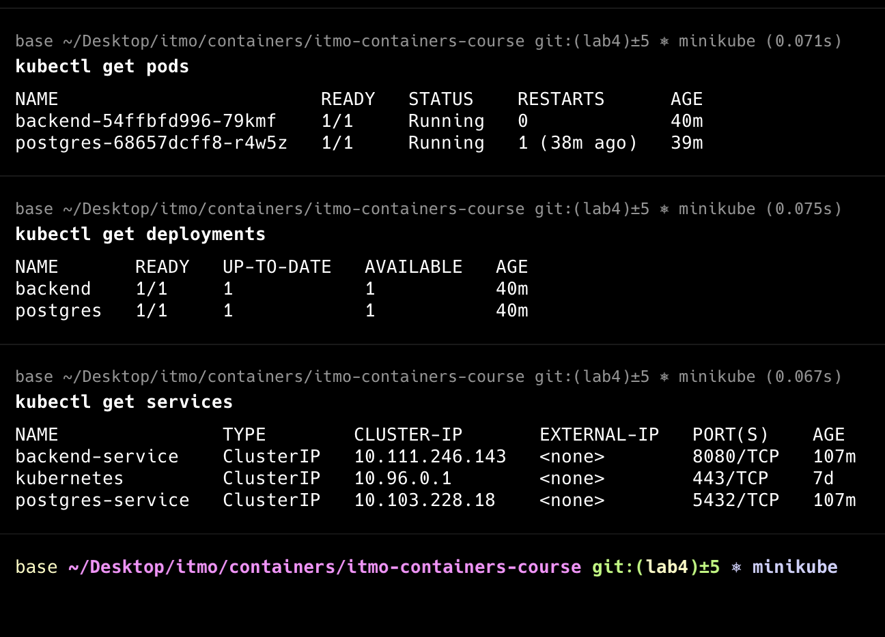
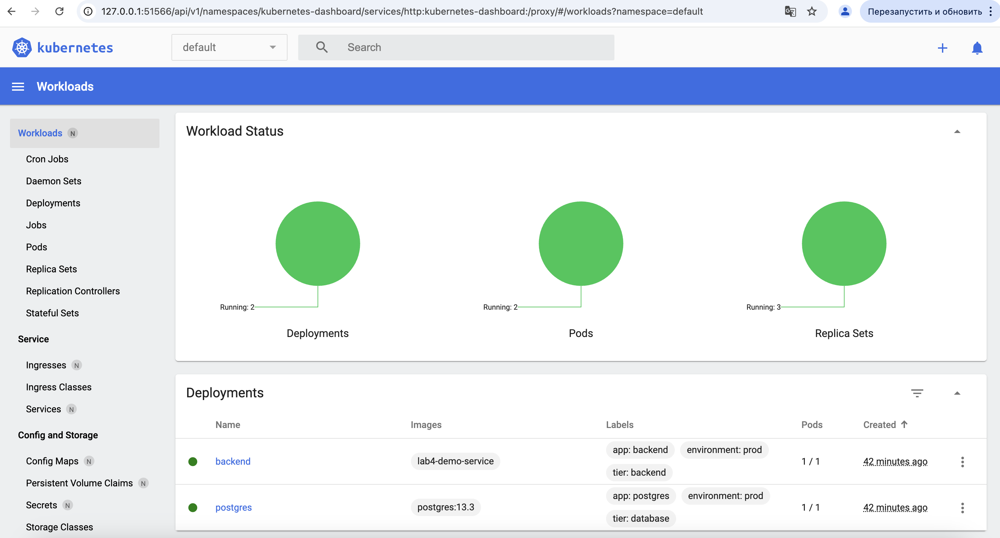
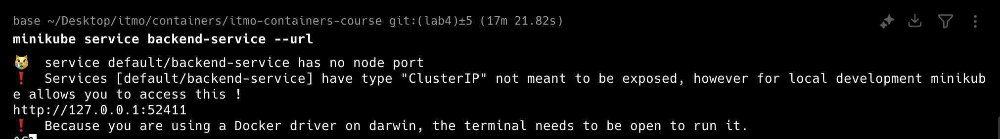
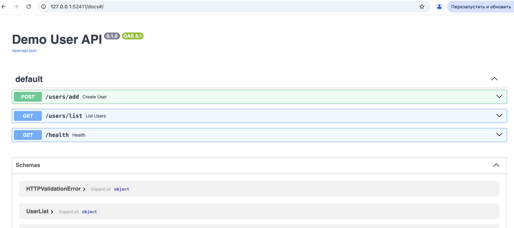
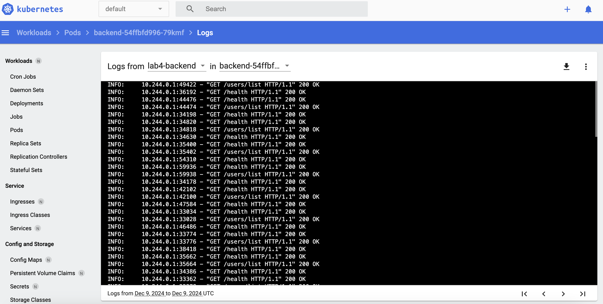

# itmo-containers-course

Практика и лабораторные курса "Контейнеризация и оркестрация" AITH в ИТМО.

## Лабы

- [lab 1](https://github.com/boomb0om/itmo-containers-course/tree/lab1)
- [lab 2](https://github.com/boomb0om/itmo-containers-course/tree/lab2)
- [lab 3](https://github.com/boomb0om/itmo-containers-course/tree/lab3)
- [lab 4](https://github.com/boomb0om/itmo-containers-course/tree/lab4)

## Лаба 4

Развернуть свой собственный сервис в Kubernetes, по аналогии с ЛР 3

Можно использовать Minikube из ЛР 3. Нужно развернуть сервис в связке из минимум 2 контейнеров + 1 init, по аналогии с ЛР 2.

Требования:
- минимум два `Deployment`, по количеству сервисов
- кастомный образ для минимум одного `Deployment` (т.е. не публичный и собранный из своего *Dockerfile*)
- минимум один `Deployment` должен содержать в себе контейнер и инит-контейнер
- минимум один `Deployment` должен содержать `volume` (любой)
- обязательно использование `ConfigMap` и/или `Secret`
- обязательно `Service` хотя бы для одного из сервисов (что логично, если они работают в связке)
- `Liveness` и/или `Readiness` пробы минимум в одном из `Deployment`
- обязательно использование лейблов (помимо обязательных `selector/matchLabel`, конечно)

### Реализация

За основу была взята [лабораторная 2](https://github.com/boomb0om/itmo-containers-course/tree/lab2).
В качестве сервисов там используется БД postgresql и сервис работы с этой базы и 2 ручками (не считая healthcheck).

Были созданы несколько манифестов:
- [manifests/configmap.yaml](manifests/configmap.yaml) - КонфигМапа для приложения
- [manifests/postgres_secret.yaml](manifests/postgres_secret.yaml) - Секреты для постгреса
- [manifests/postgres_pvc.yaml](manifests/postgres_pvc.yaml) - Персистентное хранилище volume
- [manifests/postgres_deployment.yaml](manifests/postgres_deployment.yaml) - Деплоймент для постгреса
- [manifests/postgres_service.yaml](manifests/postgres_service.yaml) - Сервис для постгреса
- [manifests/backend_deployment.yaml](manifests/backend_deployment.yaml) - Деплоймент для бэкенда
- [manifests/backend_service.yaml](manifests/backend_service.yaml) - Сервис для бэкенда

Комментарии можно найти в самих манифестах.
- В [manifests/postgres_deployment.yaml](manifests/postgres_deployment.yaml) есть подключение volume
- В [manifests/postgres_deployment.yaml](manifests/postgres_deployment.yaml) есть liveness проба для постгреса
- В [manifests/backend_deployment.yaml](manifests/backend_deployment.yaml) есть liveness и readness пробы
- В [manifests/backend_deployment.yaml](manifests/backend_deployment.yaml) запускается initContainer для выполнения миграций в БД
- В [manifests/backend_deployment.yaml](manifests/backend_deployment.yaml) используется локальные докер-образы

**Порядок запуска:**

Собрать образы:
```bash
docker compose build
```

Загрузить образы в реестр миникуба:
```bash
minikube image load lab4-db-migrate lab4-demo-service
```

Запустить команды:
```bash
kubectl apply -f manifests/configmap.yaml
kubectl apply -f manifests/postgres_secret.yaml
kubectl apply -f manifests/postgres_pvc.yaml
kubectl apply -f manifests/postgres_deployment.yaml
kubectl apply -f manifests/postgres_service.yaml
kubectl apply -f manifests/backend_deployment.yaml
kubectl apply -f manifests/backend_service.yaml
```

Или же запустить `.sh` файл с этими командами:
```bash
sh kubectl_run.sh
```

**Проверяем корректность запуска**:

Смотрим что все запустилось


Дашборд:


Попробуем подключиться к сервису:



liveness и readness пробы тоже работают корректно:
