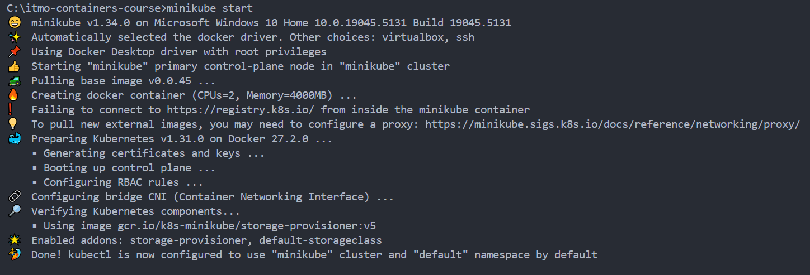
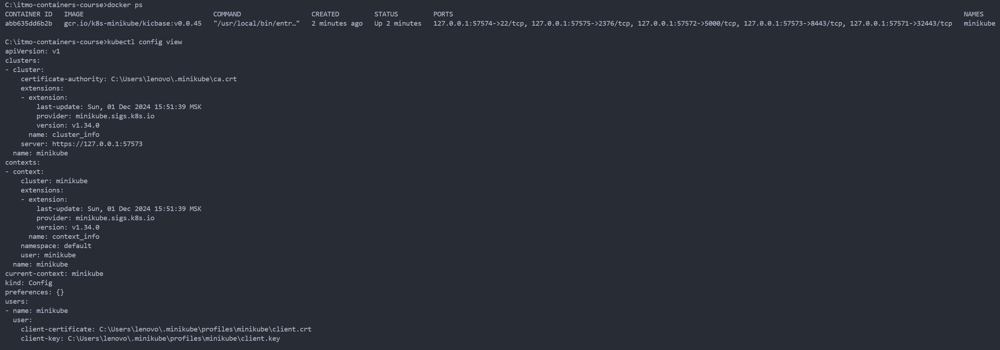
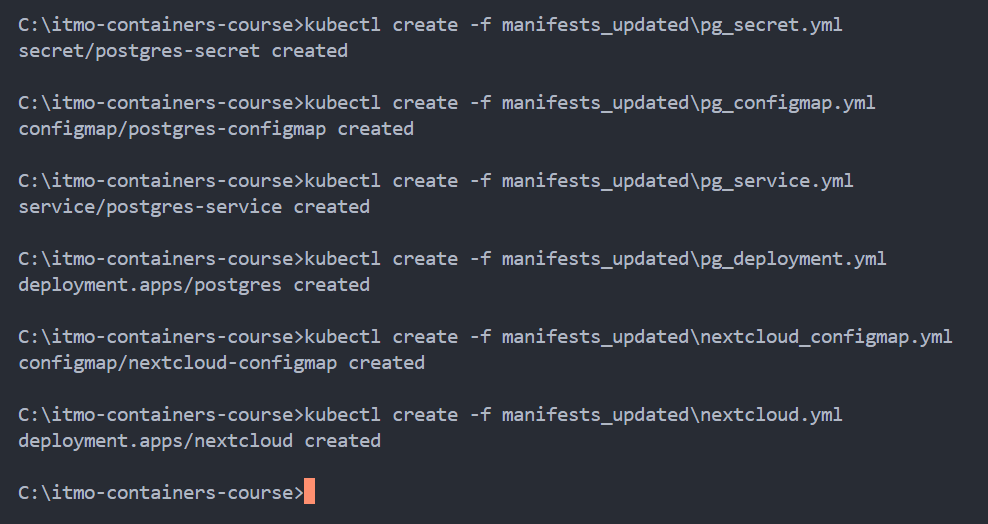
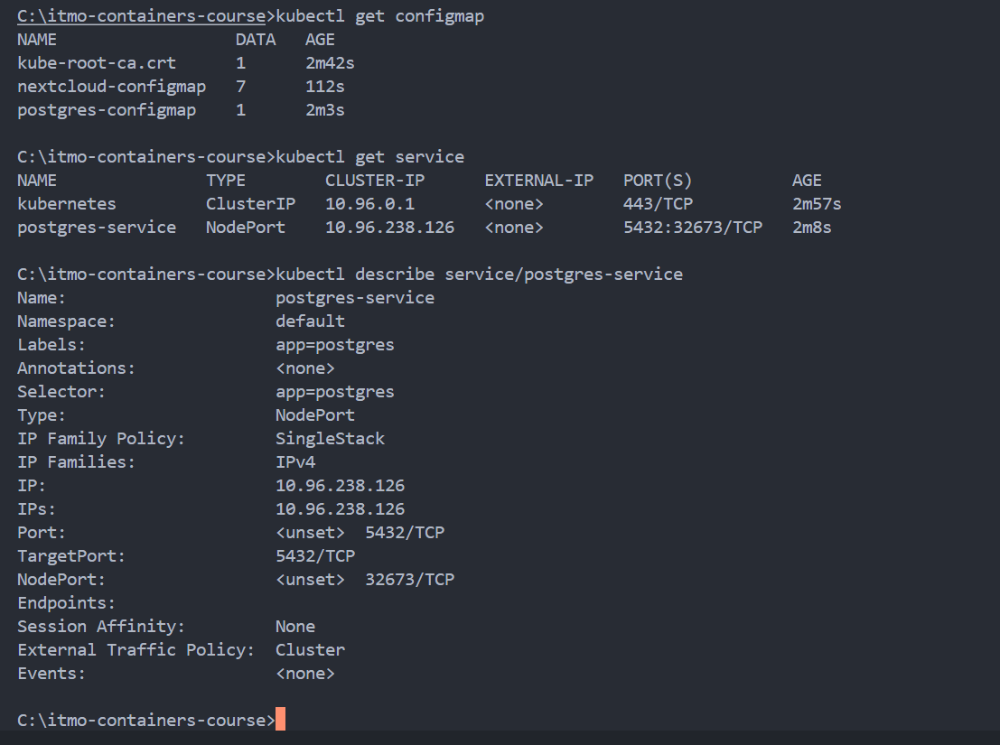
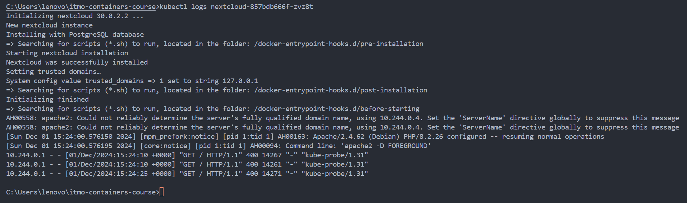

# itmo-containers-course

Практика и лабораторные курса "Контейнеризация и оркестрация" AITH в ИТМО.

## Лабы

- [lab 1](https://github.com/boomb0om/itmo-containers-course/tree/lab1)
- [lab 2](https://github.com/boomb0om/itmo-containers-course/tree/lab2)
- [lab 3](https://github.com/boomb0om/itmo-containers-course/tree/lab3)
- [lab 4](https://github.com/boomb0om/itmo-containers-course/tree/lab4)

## Лабораторная работа №3

### Задание

Осуществить махинации над манифестами из примера, чтоб получить следующее:
- Для постгреса перенести POSTGRES_USER и POSTGRES_PASSWORD из конфигмапы в секреты (очевидно, понадобится 
новый манифест для сущности Secret)
- Для некстклауда перенести его переменные (NEXTCLOUD_UPDATE ,ALLOW_EMPTY_PASSWORD и проч.) из деплоймента в 
конфигмапу (очевидно, понадобится новый манифест для сущности ConfigMap)
- Для некстклауда добавить Liveness и Readiness пробы

**Дополнительные вопросы:**
1. Важен ли порядок выполнения манифестов? Почему?
2. Что (и почему) произойдет, если отскейлить количество реплик postgres-deployment в 0, затем обратно в 1, после чего попробовать снова зайти на Nextcloud? 

### Отчетность

#### Запуск minikube

#### Проверка запуска

#### Создание объектов в кластере

#### Проверка создания ресурсов

#### Проверка логов для пода

#### Создание объекта для деплоймента с перенаправлением портов

#### Осуществление туннелирования трафика

#### Создание дашборда

### Ответы на дополнительные вопросы

1. Важен ли порядок выполнения манифестов? Почему?

Да, важен.

Многие ресурсы в `Kubernetes` зависят друг от друга. В данном случае `Deployment` зависит от `ConfigMap`, который содержит конфигурационные параметры для `postgres`, - информация из `ConfigMap` передается в Deployment через `envFrom`, и если сначала создать `Deployment`, а затем `ConfigMap`, то `Deployment` не получит нужные и данные и не сможет запуститься.

Также до `Deployment` (и после `ConfigMap`) следует создавать `Service`. Это обеспечит доступ к подам, которые будут созданы в следующем шаге. Создание сервиса до `Deployment` позволяет ему сразу же начать маршрутизацию трафика к подам, как только они будут готовы. Если `Deployment` создается до `Service`, то при старте подов они могут быть недоступны для внешнего трафика до тех пор, пока сервис не будет создан.

2. Что (и почему) произойдет, если отскейлить количество реплик `postgres-deployment` в 0, затем обратно в 1, после чего попробовать снова зайти на `Nextcloud`?

Когда количество реплик `postgres-deployment` устанавливается в 0, все поды `Postgres` будут остановлены, и база данных станет недоступной. `Nextcloud` потеряет соединение с базой, и останется в состоянии, когда база для него не доступна. Если после этого отскейлить количество реплик обратно в 1, база данных запустится снова, но вот `Nextcloud` останется в том же состоянии, когда соединение потеряно, так как он не пытается автоматически переподключаться к ней. Таким образом, после таких махинаций доступа у `Nextcloud` к базе не будет.